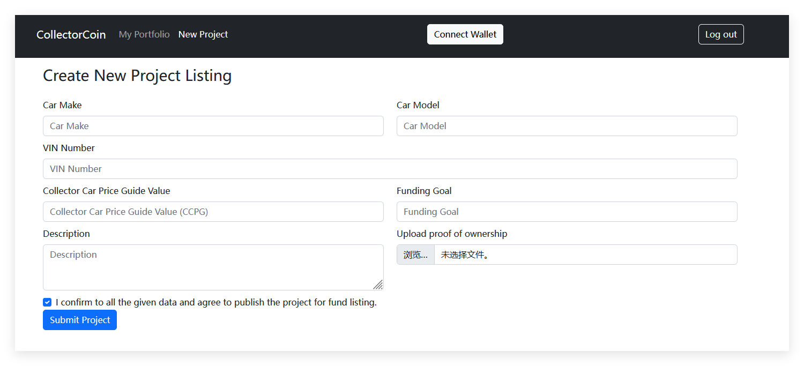

结合你提供的截图和代码逻辑，以下是针对 **“新建资产 (New Project)”** 页面的详细操作指南：

### 1. 这个页面数据如何填写？

根据代码 `web3Utils.js` 中的合约调用逻辑 (`createNewProject`) 以及后端模型 `ProjectListing.java`，各字段含义如下：

* **VIN (Vehicle Identification Number)** :
* **含义** : 资产的唯一识别码（类似于古董的证书编号或汽车的车架号）。
* **怎么填** : 填一个不重复的字符串，例如 `VIN-2026-001` 或真实的车辆识别码。
* *注意：合约中通常要求唯一性，不要和之前测试填的一样。*
* **Make (Manufacturer)** :
* **含义** : 品牌/制造商。
* **怎么填** : 例如 `Ferrari`, `Ming Dynasty` (明朝), `Rolex` 等。
* **Model** :
* **含义** : 具体型号或名称。
* **怎么填** : 例如 `488 Spider`, `Blue & White Porcelain` (青花瓷)。
* **CCPG (Collector Coin Per Gram / Price Guide)** :
* **含义** : 这是合约中的 `_ccpg` 参数，代表 **“单位估值”** 或  **“初始参考价”** 。
* **怎么填** : 填一个整数。例如 `500`。这通常用于计算资产的基础价值。
* **Funding Goal** :
* **含义** :  **众筹/融资目标金额** 。你希望通过发行这个资产筹集多少代币？
* **怎么填** : 填一个整数（单位是 Wei 或 Token 数量）。例如 `10000`。
* *注意：这个数值决定了后续投资者需要投多少钱才能填满进度条。*
* **Description (如有)** :
* **怎么填** : 简单的文字描述，例如 "A rare antique from 18th century."。
* **Upload Image (文件上传)** :
* **操作** : 点击选择一张本地图片。这很重要，因为后端 `ProcessListingService` 会检查文件是否存在。

---

### 2. Submit Project 后，下一步我该做什么？

点击 "Submit" 按钮后，系统会发生一系列  **“接力跑”** 。你需要按照以下顺序操作：

#### 第一步：处理 Web3 弹窗 (立即发生)

1. **MetaMask 弹窗** : 浏览器右上角的 MetaMask 会立刻弹出来。
2. **确认支付** : 它会提示你支付 Gas 费（这是调用 `CCProjectFactory` 合约的费用）。
3. **操作** : 点击  **“确认 (Confirm)”** 。

* *如果不点确认，或者账号没钱，流程就会卡死在这里，后台永远收不到数据。*

#### 第二步：等待后端处理 (自动发生)

* 一旦区块链交易确认（Tx Success），前端会自动把数据发给 Java 后端。
* Java 后端会启动一个  **jBPM 流程实例** 。根据代码，这个流程的第一步通常是  **“人工审批 (Approve Listing)”** 。

#### 第三步：切换角色进行审批 (你真正要做的下一步)

此时，作为“卖家 (Owner)”的任务已经完成了。资产进入了“待审核”状态。你需要：

1. **退出登录 (Logout)** : 点击右上角的 Logout。
2. **切换账号** : 使用 **管理员 (Admin)** 账号登录（我们在数据库初始化时创建的那个 `ROLE_ADMIN` 用户）。
3. **进入管理后台** : 找到 **Admin Portal** 页面。
4. **执行审批** :

* 你应该能看到刚才提交的那条资产记录，状态可能是 `Submitted` 或 `Pending Approval`。
* 点击 **“Approve (审批通过)”** 按钮。
* *注意：审批操作通常也会触发 Web3 交易（更新合约状态），所以 MetaMask 可能会再次弹窗，记得点确认。*

总结你的行动路线：

填表 -> MetaMask 签名 -> 登出 -> 换 Admin 账号 -> 审批通过。
